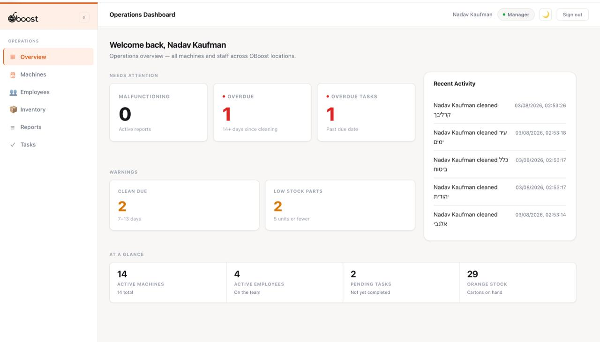
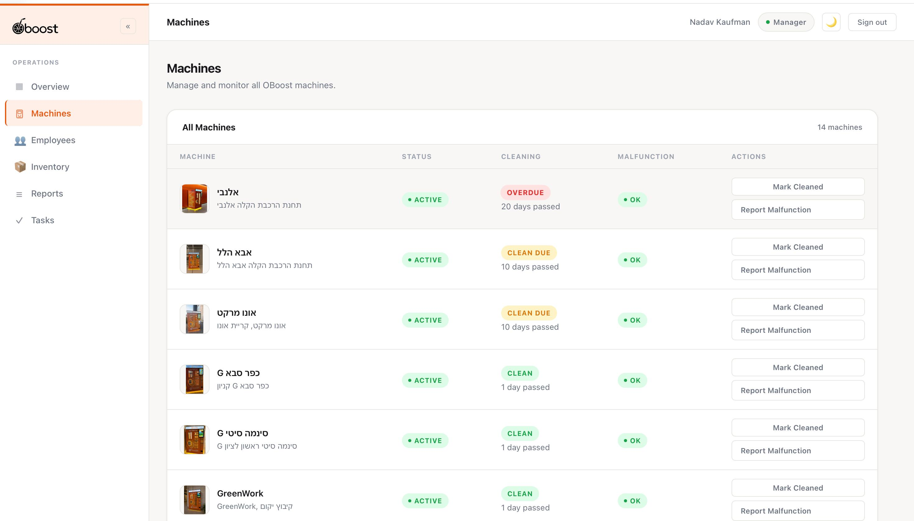
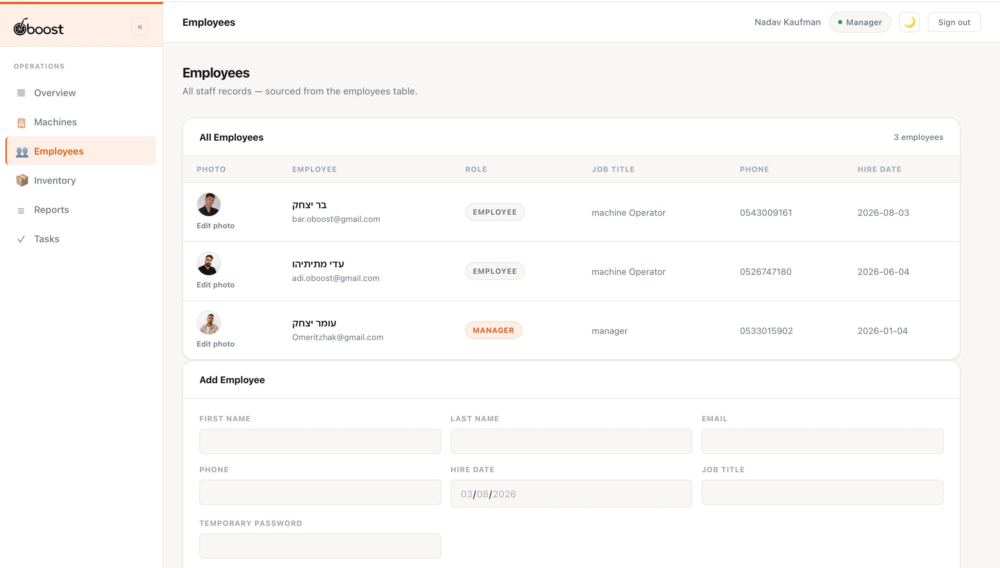

# OBoost Portal

An internal operations portal for managing fresh orange juice vending machines across multiple locations — cleaning schedules, fault tracking, staff records, and inventory in one place.

## Live Website

 [https://oboost-portal.netlify.app/](https://oboost-portal.netlify.app/)

## Screenshots

### Overview


### Machines


### Employees


## Business problem

OBoost operates fresh orange juice vending machines across multiple locations, with no shared system to track cleaning schedules, faults, or staff assignments. OBoost Manager replaces that ad-hoc tracking with a single, role-aware dashboard backed by a real database.

## Main features

- **Machine tracking** — cleaning status (Clean / Needs Cleaning / Overdue) and fault status for each fresh orange juice vending machine, computed from a fixed 21-day cycle. Marking a machine cleaned persists an atomic status update plus an audit-log row.
- **Fault handling** — any authenticated user can report a malfunction (description, fault type, severity, optional photo); managers clear the fault once it's repaired.
- **Task management** — managers create and assign tasks, general or cleaning, to employees. Completing a cleaning task automatically marks its linked machine as cleaned, in the same transaction.
- **Inventory tracking** — orange cartons (for the juice) and spare parts as a signed-quantity transaction ledger, with a database-level guard against negative stock.
- **Reports** — cleaning, malfunction, inventory, and task history, queried live from Supabase.
- **Employee management** — managers view all staff and add new employees, which creates a real Supabase Auth account.

## Role model and access control

The app has two roles: **employee** and **manager**. Managers get the full operational views — dashboard, machines, employees, reports, tasks. Employees get their own machines, tasks, and activity history, plus shared access to inventory. Machine detail and malfunction reporting are open to any authenticated user, not role-gated.

Authorization is enforced in the database through PostgreSQL Row Level Security (RLS) and security-definer RPCs, making the database — not the UI — the source of truth.

## Technology stack

- React 19 + TypeScript, built with Vite
- Plain CSS — no UI component library
- Supabase: PostgreSQL, Auth, Row Level Security, pg_cron
- React Router v7

## Architecture

A single-page React app — pages and components in `src/`, local component state throughout, no global store. All Supabase access is centralized in one typed client (`src/lib/supabase.ts`), so pages never call the database directly, and routing/authorization both key off the user's role from `profiles`.

Schema, RLS policies, and RPCs are tracked as ordered, hand-run SQL migrations in `backend/migrations/`, applied directly against the Supabase project rather than through a migration tool.

## Local setup

```bash
npm install
```

```bash
cp .env.example .env.local
```

Fill in your Supabase project's URL and anon key in `.env.local` (`VITE_SUPABASE_URL`, `VITE_SUPABASE_ANON_KEY` — never the `service_role` key), then run every file in `backend/migrations/` in order via the Supabase SQL Editor.

```bash
npm run dev
```

## Deployment

Deployed on Netlify: build command `npm run build`, publish directory `dist`, with `public/_redirects` handling SPA routing so client-side routes resolve correctly on refresh or direct navigation.
